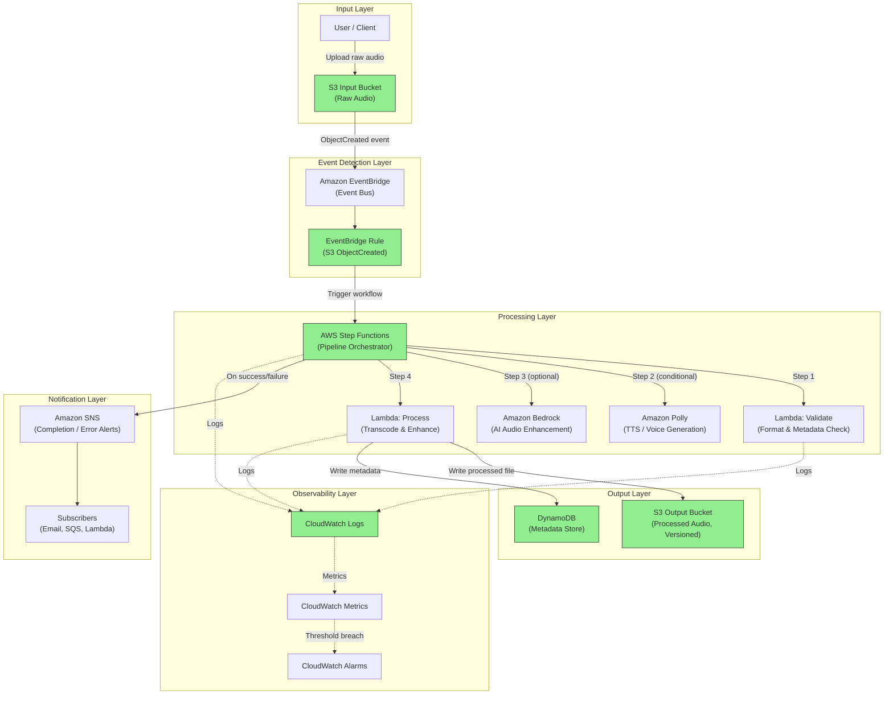

# Architecture

## High-Level Overview

The Event-Driven Sleep Audio Pipeline is a serverless system built with AWS CDK (Python) that processes audio content for sleep and relaxation applications. Users upload raw audio files (voice recordings, ambient sounds, etc.) to an S3 input bucket. The system automatically detects uploads via EventBridge, orchestrates multi-step processing through AWS Step Functions, and delivers processed audio to an output bucket with full metadata tracking and notification support.

The architecture follows an event-driven, loosely coupled design where each component communicates through events rather than direct invocation. This enables independent scaling, straightforward observability, and clean separation of concerns.

---

## Current Implementation Status

The following components have been implemented in the CDK stack:

| Component | Status | Notes |
|-----------|--------|-------|
| S3 Input Bucket | Implemented | Versioned, SSE-S3 encrypted, public access blocked, EventBridge notifications enabled |
| S3 Output Bucket | Implemented | Versioned, SSE-S3 encrypted, public access blocked |
| EventBridge Rule | Implemented | Matches "Object Created" events from the input bucket |
| EventBridge Rule Target | Implemented | Targets the Step Functions state machine with event detail input |
| Step Functions | Implemented | Skeleton state machine with Polly startSpeechSynthesisTask (placeholder params) |
| Lambda: Validate | Planned | |
| Lambda: Process | Planned | |
| DynamoDB Metadata Store | Implemented | On-demand billing, SSE, PITR, audioId partition key |
| SNS Notifications | Planned | |
| CloudWatch Alarms | Planned | |

---

### Design Principles

- **Event-driven**: All processing is triggered by events, not polling or scheduled jobs
- **Serverless-first**: No servers to manage; pay only for what you use
- **Least privilege**: Every component has minimal IAM permissions required for its function
- **Observable**: Structured logging, metrics, and alarms at every stage
- **Multi-environment**: Identical infrastructure deployed across dev, stage, and prod via CDK context

---

## System Architecture Diagram



> Legend: Green-filled nodes are implemented. Default-styled nodes are planned.

---

## Orchestration Layer

The **AudioPipelineStateMachine** is an AWS Step Functions Standard Workflow that orchestrates the audio processing pipeline. It is triggered by EventBridge when a new object is uploaded to the input S3 bucket.

**Current state:** Pipeline with DynamoDB metadata tracking and error handling around the Polly task.

**Definition flow:**

```
Start -> WriteInitialRecord (DynamoDB PutItem) -> PollyTask -> UpdateStatusCompleted (DynamoDB UpdateItem) -> Done (Succeed)
                |                                      |
                | (on error)                           | (on error)
                v                                      v
              Fail                             UpdateStatusFailed (DynamoDB UpdateItem) -> Fail
```

- **WriteInitialRecord** writes an initial metadata record to DynamoDB with `audioId`, `status=PROCESSING`, `inputBucket`, `inputKey`, and `createdAt`. If this step fails (e.g., DynamoDB is unavailable), the execution routes directly to the Fail state since no metadata record can be written.
- **PollyTask** uses the `CallAwsService` integration (`arn:aws:states:::aws-sdk:polly:startSpeechSynthesisTask`) to invoke Amazon Polly with placeholder parameters (text="placeholder", voice_id="Joanna", output_format="mp3").
- **UpdateStatusCompleted** updates the DynamoDB record to `status=COMPLETED` with `updatedAt` timestamp on successful Polly execution.
- **UpdateStatusFailed** catches errors from PollyTask, updates the DynamoDB record to `status=FAILED` with `updatedAt` timestamp, then transitions to the Fail state.
- The state machine execution role has least-privilege permissions scoped to `polly:startSpeechSynthesisTask` and CDK-managed write access to the metadata table (granted via L2 construct defaults).
- CloudWatch Logs are enabled at the ALL level for full execution tracing.
- EventBridge passes the S3 event detail (bucket name, object key) as input to the state machine via `InputPath: $.detail`.

---

## Metadata Layer

The **SleepAudioMetadataTable** is an Amazon DynamoDB table that tracks the lifecycle of each audio file as it moves through the processing pipeline.

### Table Schema

| Attribute | Type | Role |
|-----------|------|------|
| `audioId` | String (S) | Partition key - derived from the S3 object key |
| `status` | String (S) | Processing status: PROCESSING, COMPLETED, or FAILED |
| `inputBucket` | String (S) | Source S3 bucket name |
| `inputKey` | String (S) | Source S3 object key |
| `createdAt` | String (S) | ISO 8601 timestamp when processing started |
| `updatedAt` | String (S) | ISO 8601 timestamp of the last status update |

### Table Configuration

- **Billing mode:** PAY_PER_REQUEST (on-demand) for unpredictable workloads
- **Encryption:** AWS-managed server-side encryption (SSE)
- **Point-in-time recovery:** Enabled for data protection
- **Removal policy:** DESTROY (development mode)

### Status Transitions

1. **PROCESSING** - Written by `WriteInitialRecord` (DynamoDB PutItem) at the start of the pipeline
2. **COMPLETED** - Written by `UpdateStatusCompleted` (DynamoDB UpdateItem) after successful Polly execution
3. **FAILED** - Written by `UpdateStatusFailed` (DynamoDB UpdateItem) when PollyTask throws an error

### State Machine I/O Handling

The state machine receives input from EventBridge as `$.detail`, which contains the S3 event structure:
- `$.bucket.name` - the S3 bucket that received the upload
- `$.object.key` - the key of the uploaded object

These values are used by the DynamoDB tasks via `JsonPath.string_at()` references. The context variable `$$.State.EnteredTime` provides ISO 8601 timestamps for `createdAt` and `updatedAt` fields.

---

## Data Flow

### Happy Path

1. **Upload**: A user or client application uploads a raw audio file to the S3 input bucket. The upload includes metadata headers (e.g., `x-amz-meta-user-id`, content type).

2. **Event Detection**: With EventBridge notifications enabled on the input bucket, S3 emits an `Object Created` event to EventBridge. An EventBridge rule matches `s3:ObjectCreated:*` events for the input bucket and triggers the Step Functions state machine.

3. **Validation**: The first Lambda function in the Step Functions workflow validates the uploaded file:
   - Checks file format (WAV, MP3, OGG, FLAC)
   - Extracts metadata (duration, sample rate, channels, file size)
   - Associates the upload with a `user_id` derived from an authenticated upload context and/or a controlled object key prefix
   - Rejects invalid files with appropriate error handling

4. **Processing**: Based on the file type and user preferences:
   - **Amazon Polly** generates soothing text-to-speech audio (e.g., sleep stories, guided meditations)
   - **Amazon Bedrock** (optional) applies AI-based audio enhancement or generates complementary sleep sounds
   - **Processing Lambda** performs transcoding, normalization, or mixing

5. **Output**: The processed audio file is written to the versioned S3 output bucket with a structured key path (e.g., `processed/{user_id}/{timestamp}/{filename}`).

6. **Metadata Storage**: DynamoDB stores a record for each processed file:
   - `file_id` (partition key)
   - `user_id` (GSI)
   - `input_key`, `output_key`
   - `duration_seconds`
   - `processing_status` (PENDING, PROCESSING, COMPLETED, FAILED)
   - `created_at`, `completed_at`
   - `file_size_bytes`
   - `content_type`

7. **Notification**: SNS publishes a completion message. On failure, an error notification is sent with details for debugging.

### Error Path

- If validation fails, the state machine transitions to a failure state, records the error in DynamoDB, and sends an SNS notification with the failure reason.
- Step Functions provides built-in retry with exponential backoff for transient errors (e.g., throttling, service unavailability).
- Optionally configure an SQS dead-letter queue (DLQ) on the EventBridge rule target to capture events that cannot be delivered after retries.

---

## AWS Services and Rationale

| Service | Role | Why This Service |
|---------|------|-----------------|
| **Amazon S3** | Input/output storage | Virtually unlimited storage, event notifications, server-side encryption, versioning, lifecycle policies |
| **Amazon EventBridge** | Event routing | Native S3 integration, content-based filtering, replay capability, schema registry |
| **AWS Step Functions** | Workflow orchestration | Visual workflow, built-in retries/error handling, parallel execution, state management without custom code |
| **AWS Lambda** | Compute for validation/processing | Pay-per-invocation, auto-scaling, no infrastructure management, supports Python runtime |
| **Amazon Polly** | Text-to-speech generation | Neural voices for natural-sounding audio, multiple languages, SSML support for fine control |
| **Amazon Bedrock** | AI audio enhancement | Managed foundation models, no ML infrastructure, pay-per-request, extensible to future models |
| **Amazon DynamoDB** | Metadata storage | Single-digit ms latency, auto-scaling, no connection management, flexible schema |
| **Amazon SNS** | Notifications | Fan-out to multiple subscribers, message filtering, integration with email/SQS/Lambda/HTTP |
| **Amazon CloudWatch** | Observability | Native integration with all services, structured logs, custom metrics, composite alarms |

---

## Security

### Encryption

- **At rest**: All S3 buckets use SSE-S3 or SSE-KMS encryption. DynamoDB uses AWS-managed encryption. SNS topics are encrypted with KMS.
- **In transit**: All communication uses TLS 1.2+. S3 bucket policies enforce `aws:SecureTransport`.

### Access Control

- **Least privilege IAM roles**: Each Lambda function has a dedicated IAM role with only the permissions it needs (e.g., the validation Lambda can read from the input bucket but cannot write to the output bucket).
- **S3 bucket policies**: Public access is blocked at the account and bucket level. Only specific roles can read/write.
- **Resource-based policies**: Step Functions execution role is scoped to invoke only the specific Lambdas in the workflow.
- **VPC considerations**: Lambdas that do not need internet access can run in private subnets if VPC deployment is required.

### Data Protection

- S3 versioning on the output bucket prevents accidental data loss
- DynamoDB point-in-time recovery enabled for metadata
- CloudTrail logs all API calls for audit

---

## Observability

### Logging

- All Lambda functions emit structured JSON logs to CloudWatch Logs
- Step Functions execution history provides visual debugging
- Log retention configured per environment (7 days dev, 30 days stage, 90 days prod)

### Metrics

- **Custom metrics**: Files processed per minute, processing duration, error rate
- **Service metrics**: Lambda duration/errors/throttles, DynamoDB consumed capacity, S3 request counts

### Alarms

- Processing error rate exceeds threshold (5% over 5 minutes)
- Step Functions execution failure
- Lambda function errors or throttling
- DynamoDB throttled requests
- S3 bucket 4xx/5xx error rates

### Dashboards

- Operational dashboard showing pipeline health, throughput, and latency
- Per-environment dashboards for comparison

---

## Multi-Environment Support

The pipeline supports `dev`, `stage`, and `prod` environments via CDK context values:

| Parameter | Dev | Stage | Prod |
|-----------|-----|-------|------|
| Log retention | 7 days | 30 days | 90 days |
| DynamoDB billing | On-demand | On-demand | Provisioned |
| Alarm actions | None | Email | PagerDuty + Email |
| S3 lifecycle | 30-day expiry | 90-day expiry | No expiry |
| Bedrock enabled | No | Yes | Yes |
| Removal policy | DESTROY | DESTROY | RETAIN |

Environments are deployed using:

```bash
cdk deploy -c environment=dev
cdk deploy -c environment=stage
cdk deploy -c environment=prod
```

---

## Cost Considerations

- **Lambda**: Billed per request and duration. Short-lived audio processing tasks minimize cost.
- **Step Functions**: Standard workflows billed per state transition. Express workflows available for high-throughput, cost-sensitive paths.
- **S3**: Storage costs scale with data volume. Lifecycle policies automatically transition or expire old files.
- **DynamoDB**: On-demand mode for unpredictable workloads (dev/stage); provisioned with auto-scaling for production.
- **EventBridge**: $1.00 per million events. Extremely cost-effective for this use case.
- **Polly**: Billed per character synthesized. Neural voices cost more but produce better quality.
- **Bedrock**: Pay-per-request pricing varies by model. Optional component, disabled in dev.

### Cost Optimization Strategies

- Use S3 Intelligent-Tiering for the output bucket
- Set appropriate Lambda memory sizes (profiled per function)
- Use Step Functions Express workflows where execution time is under 5 minutes
- Enable DynamoDB auto-scaling in production
- Apply S3 lifecycle rules to expire intermediate/temporary files

---

## Future Extensibility

- **Audio streaming**: Add CloudFront distribution for low-latency playback
- **User preferences**: Extend DynamoDB schema to store preferred audio profiles
- **Batch processing**: Add SQS queues for bulk upload handling
- **Content library**: Build a catalog of processed audio with search via OpenSearch
- **Mobile integration**: API Gateway + Cognito for authenticated upload/download
- **Analytics**: Kinesis Data Firehose to S3 for usage analytics and recommendation engine
- **Multi-region**: DynamoDB global tables and S3 cross-region replication for disaster recovery
- **Webhooks**: SNS HTTP/HTTPS subscriptions for third-party integrations

---

## Development Approach

- **TDD-first**: Write failing tests before adding infrastructure
- **Fine-grained assertions**: Test synthesized CloudFormation templates with `aws_cdk.assertions`
- **Incremental delivery**: One resource or concern per pull request
- **Infrastructure as code**: All resources defined in CDK, no manual console changes
