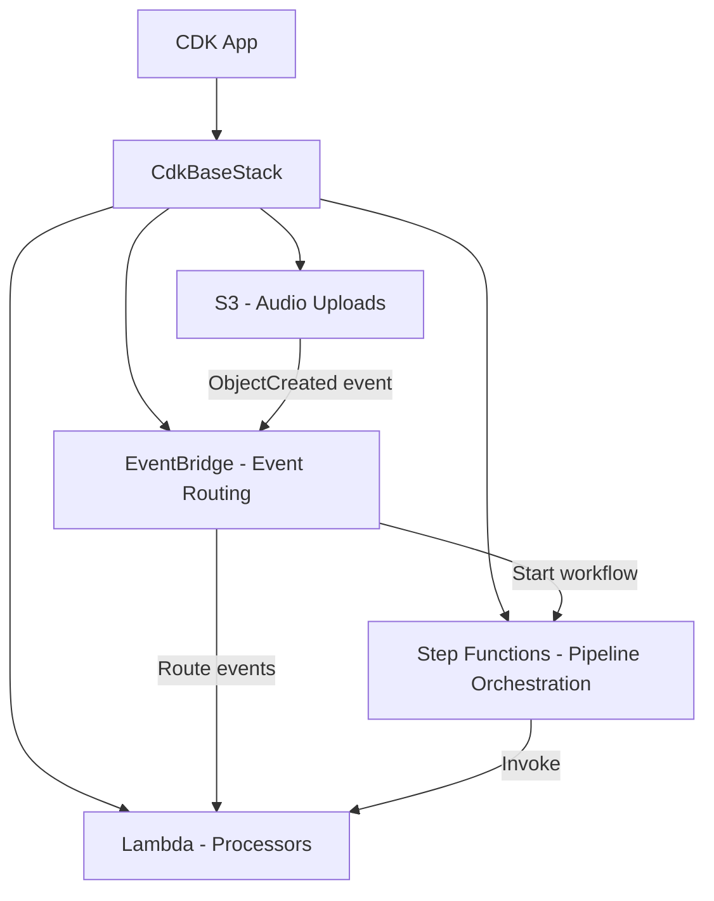

# Architecture

Event-driven sleep audio pipeline built with AWS CDK (Python).

## High-Level Architecture

## Current State

The stack is currently empty (bootstrap skeleton). Components will be added incrementally via issues:

- **S3 Bucket**: Storage for uploaded audio files
- **Lambda Functions**: Audio processing (transcoding, metadata extraction)
- **EventBridge**: Central event bus for routing domain events
- **Step Functions**: Orchestration of multi-step audio processing pipelines

## Development Approach

- TDD-first: write failing tests before adding infrastructure
- Fine-grained assertions on synthesized CloudFormation templates
- Incremental delivery: one resource/concern per PR
