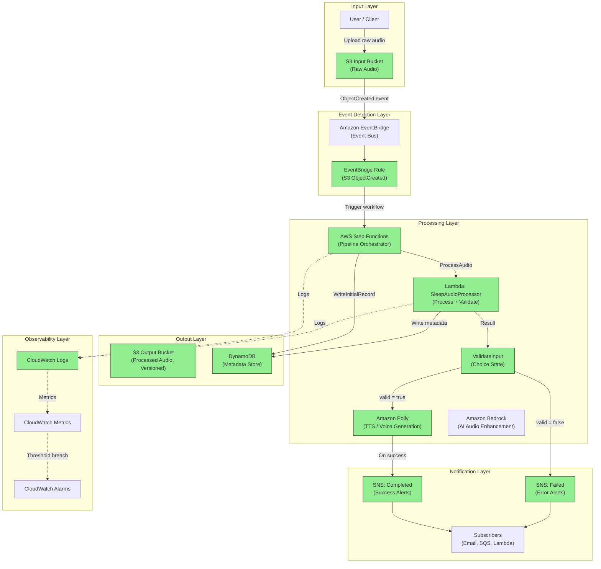
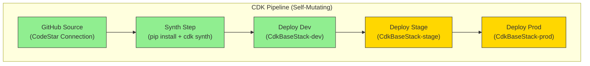
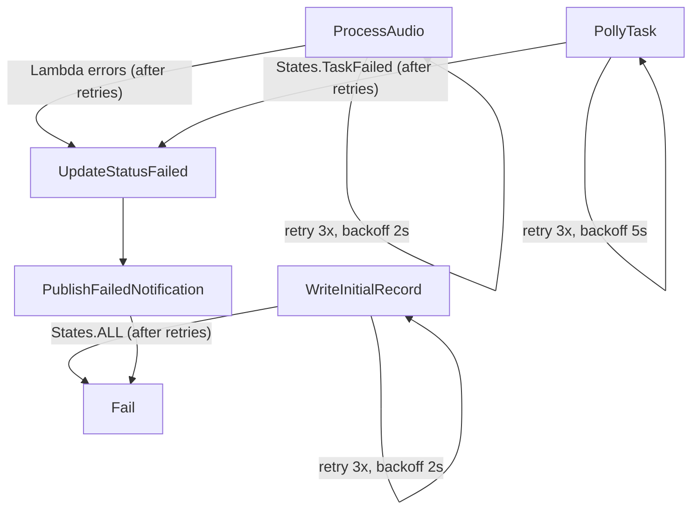
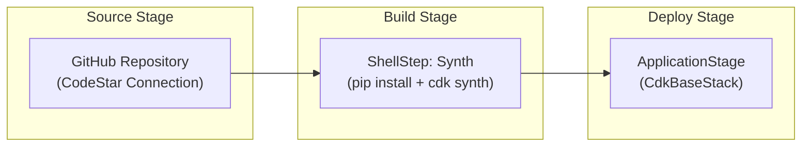

# Architecture

## High-Level Overview

The Event-Driven Sleep Audio Pipeline is a serverless system built with AWS CDK (Python) that processes audio content for sleep and relaxation applications. Users upload raw audio files (voice recordings, ambient sounds, etc.) to an S3 input bucket. The system automatically detects uploads via EventBridge, orchestrates multi-step processing through AWS Step Functions, and delivers processed audio to an output bucket with full metadata tracking and notification support.

The architecture follows an event-driven, loosely coupled design where each component communicates through events rather than direct invocation. This enables independent scaling, straightforward observability, and clean separation of concerns.

---

## Current Implementation Status

The following components have been implemented in the CDK stack:

| Component | Status | Notes |
|-----------|--------|-------|
| S3 Input Bucket | Implemented | Versioned, SSE-S3 encrypted, public access blocked, EventBridge notifications enabled |
| S3 Output Bucket | Implemented | Versioned, SSE-S3 encrypted, public access blocked |
| EventBridge Rule | Implemented | Matches "Object Created" events from the input bucket |
| EventBridge Rule Target | Implemented | Targets the Step Functions state machine with event detail input |
| Step Functions | Implemented | Skeleton state machine with Polly startSpeechSynthesisTask (placeholder params) |
| Lambda: Validate | Implemented | File extension validation (.mp3, .wav, .ogg, .flac) in SleepAudioProcessor + ValidateInput Choice state |
| Lambda: Process | Implemented | SleepAudioProcessor - Python 3.11, logs input, returns enriched metadata |
| DynamoDB Metadata Store | Implemented | On-demand billing, SSE, PITR, audioId partition key |
| SNS Notifications | Implemented | KMS-encrypted Completed/Failed topics with Step Functions integration |
| CloudWatch Alarms | Implemented | State machine failures and Lambda errors alarms |

---

### Design Principles

- **Event-driven**: All processing is triggered by events, not polling or scheduled jobs
- **Serverless-first**: No servers to manage; pay only for what you use
- **Least privilege**: Every component has minimal IAM permissions required for its function
- **Observable**: Structured logging, metrics, and alarms at every stage
- **Multi-environment**: Identical infrastructure deployed across dev, stage, and prod via CDK context

---

## System Architecture Diagram



> Legend: Green-filled nodes are implemented. Default-styled nodes are planned.

### Deployment Pipeline Flow



> Legend: Green = implemented, Yellow = planned (manual approval gates, multi-stage deployment).

---

## Orchestration Layer

The **AudioPipelineStateMachine** is an AWS Step Functions Standard Workflow that orchestrates the audio processing pipeline. It is triggered by EventBridge when a new object is uploaded to the input S3 bucket.

**Current state:** Complete pipeline with DynamoDB metadata tracking, Lambda audio processing with file extension validation, a ValidateInput Choice state for routing, Amazon Polly integration, SNS notifications, and error handling.

**Definition flow:**

```
Start -> WriteInitialRecord (DynamoDB PutItem) -> ProcessAudio (Lambda Invoke) -> ValidateInput (Choice) -> PollyTask -> UpdateStatusCompleted (DynamoDB UpdateItem) -> PublishCompletedNotification (SNS Publish) -> Done (Succeed)
                |                                      |                              |                          |
                | (on error)                           | (on error)                   | (valid = false)          | (on error)
                v                                      v                              v                          v
              Fail                             UpdateStatusFailed (DynamoDB) -> PublishFailedNotification -> Fail
```

- **WriteInitialRecord** writes an initial metadata record to DynamoDB with `audioId`, `status=PROCESSING`, `inputBucket`, `inputKey`, and `createdAt`. If this step fails (e.g., DynamoDB is unavailable), the execution routes directly to the Fail state since no metadata record can be written.
- **ProcessAudio** invokes the SleepAudioProcessor Lambda function to process and enrich audio metadata. The Lambda receives the full state machine input (S3 bucket and object details), validates the file extension, and returns enriched metadata including a `valid` boolean. On error, execution routes to UpdateStatusFailed.
- **ValidateInput** is a Choice state that inspects `$.processAudioResult.Payload.valid`. If `valid == true`, execution proceeds to PollyTask. If `valid == false` (unsupported file extension), execution routes to UpdateStatusFailed followed by PublishFailedNotification and then Fail.
- **PollyTask** uses the `CallAwsService` integration (`arn:aws:states:::aws-sdk:polly:startSpeechSynthesisTask`) to invoke Amazon Polly with placeholder parameters (text="placeholder", voice_id="Joanna", output_format="mp3"). On error, routes to UpdateStatusFailed.
- **UpdateStatusCompleted** updates the DynamoDB record to `status=COMPLETED` with `updatedAt` timestamp on successful Polly execution.
- **PublishCompletedNotification** publishes a message to the SleepAudioPipelineCompleted SNS topic with the `audioId` and `status=COMPLETED`.
- **UpdateStatusFailed** catches errors from PollyTask or receives invalid files from ValidateInput, updates the DynamoDB record to `status=FAILED` with `updatedAt` timestamp.
- **PublishFailedNotification** publishes a message to the SleepAudioPipelineFailed SNS topic with the `audioId` and `status=FAILED`, then transitions to the Fail state.
- The state machine execution role has least-privilege permissions scoped to `polly:startSpeechSynthesisTask`, CDK-managed write access to the metadata table, and `sns:Publish` to the two notification topics.
- CloudWatch Logs are enabled at the ALL level for full execution tracing.
- EventBridge passes the S3 event detail (bucket name, object key) as input to the state machine via `InputPath: $.detail`.

---

## Input Validation

The pipeline implements a two-layer validation approach that combines Lambda-based field and format checks with a Step Functions Choice state for routing decisions.

### Validation Layers

1. **Lambda validation (SleepAudioProcessor)**: The Lambda handler performs the actual validation logic:
   - Verifies that `bucket.name` and `object.key` are present in the input (raises `ValueError` if missing)
   - Checks the file extension of `object.key` against the list of supported audio formats
   - Returns a `valid` boolean (`True` or `False`) and, when invalid, a `validationError` string describing the issue

2. **Step Functions Choice state (ValidateInput)**: Routes the execution based on the Lambda result:
   - Condition: `$.processAudioResult.Payload.valid == true`
   - If true: proceeds to PollyTask (success path)
   - If false: routes to UpdateStatusFailed (failure path)

### Supported Audio Formats

| Extension | Format |
|-----------|--------|
| `.mp3` | MPEG Audio Layer III |
| `.wav` | Waveform Audio File |
| `.ogg` | Ogg Vorbis |
| `.flac` | Free Lossless Audio Codec |

Files with any other extension are rejected with a validation error (e.g., "Unsupported audio format: .txt").

### Error Handling for Invalid Files

When a file fails validation:
1. The Lambda returns `{ "valid": false, "validationError": "Unsupported audio format: .<ext>" }`
2. The ValidateInput Choice state routes to UpdateStatusFailed
3. DynamoDB record is updated to `status=FAILED` with `updatedAt` timestamp
4. PublishFailedNotification sends an alert to the SleepAudioPipelineFailed SNS topic
5. The state machine terminates in the Fail state

This ensures that invalid uploads are immediately rejected with clear status tracking and downstream notification, rather than consuming resources in later processing steps.

---

## Processing Layer: SleepAudioProcessor Lambda

The **SleepAudioProcessor** is an AWS Lambda function that serves as the audio processing step in the pipeline. It is invoked by Step Functions via the `LambdaInvoke` optimized integration.

### Configuration

| Setting | Value |
|---------|-------|
| Runtime | Python 3.11 |
| Handler | `handler.lambda_handler` |
| Code location | `lambda/sleep_audio_processor/` |
| Environment | `TABLE_NAME` = DynamoDB metadata table name |

### Current Behavior

The Lambda serves as both a processor and validator:
1. Receives input from the state machine (S3 bucket name and object key)
2. Validates required fields are present (raises `ValueError` if missing)
3. Validates the file extension against supported formats (.mp3, .wav, .ogg, .flac)
4. Logs the incoming event for observability
5. Returns enriched metadata including `audioId`, `bucket`, `table name`, `processing status`, `valid` boolean, and optionally `validationError`

### Future Purpose

The Lambda will be extended to handle:
- Metadata extraction (duration, sample rate, channels)
- DynamoDB metadata enrichment (writing additional attributes)
- Transcoding preparation and parameter calculation

### Permissions

- **DynamoDB**: Read/write access to the metadata table (granted via `grant_read_write_data`)
- **CloudWatch Logs**: Automatic via the Lambda execution role
- **State machine**: The Step Functions role has `lambda:InvokeFunction` permission (granted automatically by the `LambdaInvoke` construct)

---

## Metadata Layer

The **SleepAudioMetadataTable** is an Amazon DynamoDB table that tracks the lifecycle of each audio file as it moves through the processing pipeline.

### Table Schema

| Attribute | Type | Role |
|-----------|------|------|
| `audioId` | String (S) | Partition key - derived from the S3 object key |
| `status` | String (S) | Processing status: PROCESSING, COMPLETED, or FAILED |
| `inputBucket` | String (S) | Source S3 bucket name |
| `inputKey` | String (S) | Source S3 object key |
| `createdAt` | String (S) | ISO 8601 timestamp when processing started |
| `updatedAt` | String (S) | ISO 8601 timestamp of the last status update |

### Table Configuration

- **Billing mode:** PAY_PER_REQUEST (on-demand) for unpredictable workloads
- **Encryption:** AWS-managed server-side encryption (SSE)
- **Point-in-time recovery:** Enabled for data protection
- **Removal policy:** DESTROY (development mode)

### Status Transitions

1. **PROCESSING** - Written by `WriteInitialRecord` (DynamoDB PutItem) at the start of the pipeline
2. **COMPLETED** - Written by `UpdateStatusCompleted` (DynamoDB UpdateItem) after successful Polly execution
3. **FAILED** - Written by `UpdateStatusFailed` (DynamoDB UpdateItem) when PollyTask throws an error

### State Machine I/O Handling

The state machine receives input from EventBridge as `$.detail`, which contains the S3 event structure:
- `$.bucket.name` - the S3 bucket that received the upload
- `$.object.key` - the key of the uploaded object

These values are used by the DynamoDB tasks via `JsonPath.string_at()` references. The context variable `$$.State.EnteredTime` provides ISO 8601 timestamps for `createdAt` and `updatedAt` fields.

---

## Notification Layer

The notification layer provides real-time alerts when audio files complete processing or encounter errors. Two KMS-encrypted SNS topics deliver structured messages to downstream subscribers.

### SNS Topics

| Topic | Purpose | Message Payload |
|-------|---------|-----------------|
| **SleepAudioPipelineCompleted** | Notifies when audio processing finishes successfully | `{ "audioId": "<object key>", "status": "COMPLETED" }` |
| **SleepAudioPipelineFailed** | Notifies when audio processing encounters an error | `{ "audioId": "<object key>", "status": "FAILED" }` |

### Encryption

Both topics are encrypted with a dedicated KMS key (`SnsTopicEncryptionKey`):
- Key rotation is enabled (automatic annual rotation)
- Removal policy is set to DESTROY (development mode)
- The state machine execution role is automatically granted `kms:GenerateDataKey` and `kms:Decrypt` permissions via CDK L2 construct grants

### Integration with Step Functions

- **PublishCompletedNotification** runs after `UpdateStatusCompleted` in the success path, ensuring the metadata record is updated before the notification is sent
- **PublishFailedNotification** runs after `UpdateStatusFailed` in the error path, ensuring the failure is recorded in DynamoDB before alerting subscribers
- Each task stores its result in a distinct path (`$.snsCompletedResult` and `$.snsFailedResult`) to avoid overwriting the main execution state
- Both notification steps have `Catch` blocks that route to their respective terminal states (Done/Fail), ensuring a transient notification failure does not mask the pipeline outcome

### Subscribers

Subscribers can be added to either topic for alerting and downstream processing:
- **Email** - Human operators or on-call engineers
- **SQS** - Buffering for batch analytics or retry queues
- **Lambda** - Triggering further automation (e.g., cleanup, user notification)
- **HTTP/HTTPS** - Webhooks to external systems or third-party integrations

---

## Data Flow

### Happy Path

1. **Upload**: A user or client application uploads a raw audio file to the S3 input bucket. The upload includes metadata headers (e.g., `x-amz-meta-user-id`, content type).

2. **Event Detection**: With EventBridge notifications enabled on the input bucket, S3 emits an `Object Created` event to EventBridge. An EventBridge rule matches `s3:ObjectCreated:*` events for the input bucket and triggers the Step Functions state machine.

3. **Validation**: The first Lambda function in the Step Functions workflow validates the uploaded file:
   - Checks file format (WAV, MP3, OGG, FLAC)
   - Extracts metadata (duration, sample rate, channels, file size)
   - Associates the upload with a `user_id` derived from an authenticated upload context and/or a controlled object key prefix
   - Rejects invalid files with appropriate error handling

4. **Processing**: Based on the file type and user preferences:
   - **Amazon Polly** generates soothing text-to-speech audio (e.g., sleep stories, guided meditations)
   - **Amazon Bedrock** (optional) applies AI-based audio enhancement or generates complementary sleep sounds
   - **Processing Lambda** performs transcoding, normalization, or mixing

5. **Output**: The processed audio file is written to the versioned S3 output bucket with a structured key path (e.g., `processed/{user_id}/{timestamp}/{filename}`).

6. **Metadata Storage**: DynamoDB stores a record for each processed file:
   - `file_id` (partition key)
   - `user_id` (GSI)
   - `input_key`, `output_key`
   - `duration_seconds`
   - `processing_status` (PENDING, PROCESSING, COMPLETED, FAILED)
   - `created_at`, `completed_at`
   - `file_size_bytes`
   - `content_type`

7. **Notification**: SNS publishes a completion message. On failure, an error notification is sent with details for debugging.

### Error Path

- If validation fails, the state machine transitions to a failure state, records the error in DynamoDB, and sends an SNS notification with the failure reason.
- Step Functions provides built-in retry with exponential backoff for transient errors (e.g., throttling, service unavailability).
- Optionally configure an SQS dead-letter queue (DLQ) on the EventBridge rule target to capture events that cannot be delivered after retries.

---

## AWS Services and Rationale

| Service | Role | Why This Service |
|---------|------|-----------------|
| **Amazon S3** | Input/output storage | Virtually unlimited storage, event notifications, server-side encryption, versioning, lifecycle policies |
| **Amazon EventBridge** | Event routing | Native S3 integration, content-based filtering, replay capability, schema registry |
| **AWS Step Functions** | Workflow orchestration | Visual workflow, built-in retries/error handling, parallel execution, state management without custom code |
| **AWS Lambda** | Compute for validation/processing | Pay-per-invocation, auto-scaling, no infrastructure management, supports Python runtime |
| **Amazon Polly** | Text-to-speech generation | Neural voices for natural-sounding audio, multiple languages, SSML support for fine control |
| **Amazon Bedrock** | AI audio enhancement | Managed foundation models, no ML infrastructure, pay-per-request, extensible to future models |
| **Amazon DynamoDB** | Metadata storage | Single-digit ms latency, auto-scaling, no connection management, flexible schema |
| **Amazon SNS** | Notifications | Fan-out to multiple subscribers, message filtering, integration with email/SQS/Lambda/HTTP |
| **Amazon CloudWatch** | Observability | Native integration with all services, structured logs, custom metrics, composite alarms |

---

## Security

### Encryption

- **At rest**: All S3 buckets use SSE-S3 or SSE-KMS encryption. DynamoDB uses AWS-managed encryption. SNS topics are encrypted with KMS.
- **In transit**: All communication uses TLS 1.2+. S3 bucket policies enforce `aws:SecureTransport`.

### Access Control

- **Least privilege IAM roles**: Each Lambda function has a dedicated IAM role with only the permissions it needs (e.g., the validation Lambda can read from the input bucket but cannot write to the output bucket).
- **S3 bucket policies**: Public access is blocked at the account and bucket level. Only specific roles can read/write.
- **Resource-based policies**: Step Functions execution role is scoped to invoke only the specific Lambdas in the workflow.
- **VPC considerations**: Lambdas that do not need internet access can run in private subnets if VPC deployment is required.

### Data Protection

- S3 versioning on the output bucket prevents accidental data loss
- DynamoDB point-in-time recovery enabled for metadata
- CloudTrail logs all API calls for audit

---

## Error Handling and Retry Strategy

The pipeline implements a defense-in-depth approach to error handling, combining automatic retries for transient failures with specific error routing for unrecoverable issues.

### Retry Policies

Each task in the state machine has a retry policy configured for transient errors:

| Task | Retry Errors | Interval | Max Attempts | Backoff Rate |
|------|-------------|----------|--------------|--------------|
| WriteInitialRecord | States.TaskFailed | 2s | 3 | 2.0 |
| ProcessAudio | Lambda.ServiceException, Lambda.AWSLambdaException, Lambda.SdkClientException | 2s | 3 | 2.0 |
| PollyTask | States.TaskFailed | 5s | 3 | 2.0 |

Retry timing with exponential backoff:
- Attempt 1: immediate
- Attempt 2: after 2s (or 5s for Polly)
- Attempt 3: after 4s (or 10s for Polly)
- Attempt 4 (if configured): after 8s (or 20s for Polly)

### Specific Error Catches

Rather than catching all errors generically, each task catches specific error types for appropriate routing:

- **WriteInitialRecord**: Catches `States.ALL` and routes to the Fail terminal state (cannot write a FAILED record if DynamoDB is unavailable)
- **ProcessAudio**: Catches `Lambda.ServiceException`, `Lambda.AWSLambdaException`, `Lambda.SdkClientException`, and `States.TaskFailed`, routing to UpdateStatusFailed
- **PollyTask**: Catches `States.TaskFailed` and routes to UpdateStatusFailed

### Error Flow Diagram



---

## Observability

### X-Ray Tracing

Distributed tracing is enabled across the pipeline for end-to-end request visibility:

- **Lambda function**: `TracingConfig.Mode = Active` - traces all invocations with subsegment data for downstream calls
- **State machine**: `TracingConfiguration.Enabled = true` - traces the full execution flow through all states

X-Ray provides:
- Service map visualization of the pipeline
- Latency analysis per state/step
- Error and fault tracking across service boundaries
- Sampling-based low-overhead tracing

### CloudWatch Alarms

Two operational alarms monitor pipeline health:

| Alarm | Metric | Namespace | Threshold | Period | Evaluation |
|-------|--------|-----------|-----------|--------|------------|
| State Machine Failures | ExecutionsFailed | AWS/States | >= 1 | 5 min | 1 period |
| Lambda Errors | Errors | AWS/Lambda | >= 1 | 5 min | 1 period |

These alarms trigger when any execution failure or Lambda error occurs within a 5-minute window, enabling rapid incident response.

### Structured Logging

The Lambda handler emits structured JSON logs with consistent fields for queryability:

```json
{
  "requestId": "abc-123-def",
  "status": "RECEIVED|COMPLETED|ERROR",
  "audioId": "path/to/file.mp3",
  "event": { "..." : "..." },
  "valid": true,
  "error": "error message (on failure only)"
}
```

Key logging principles:
- Every log entry includes `requestId` (from `context.aws_request_id`) for correlation
- Status field tracks the processing lifecycle (RECEIVED, COMPLETED, ERROR)
- Audio ID is included in success/error logs for debugging
- JSON format enables CloudWatch Insights queries and metric filters

### Logging

- All Lambda functions emit structured JSON logs to CloudWatch Logs
- Step Functions execution history provides visual debugging
- Log retention configured per environment (7 days dev, 30 days stage, 90 days prod)

### Metrics

- **Custom metrics**: Files processed per minute, processing duration, error rate
- **Service metrics**: Lambda duration/errors/throttles, DynamoDB consumed capacity, S3 request counts

### Alarms

- Processing error rate exceeds threshold (5% over 5 minutes)
- Step Functions execution failure
- Lambda function errors or throttling
- DynamoDB throttled requests
- S3 bucket 4xx/5xx error rates

### Dashboards

- Operational dashboard showing pipeline health, throughput, and latency
- Per-environment dashboards for comparison

---

## Multi-Environment Support

The pipeline supports `dev`, `stage`, and `prod` environments via CDK context values:

| Parameter | Dev | Stage | Prod |
|-----------|-----|-------|------|
| Log retention | 7 days | 30 days | 90 days |
| DynamoDB billing | On-demand | On-demand | On-demand |
| Alarm actions | None | Email | PagerDuty + Email |
| S3 lifecycle | 30-day expiry | 90-day expiry | No expiry |
| Bedrock enabled | No | Yes | Yes |
| Removal policy | DESTROY | DESTROY | RETAIN |

### How Environment Context Works

Environment-specific behavior is controlled by the `environment` CDK context value, read via `self.node.try_get_context('environment')` in `CdkBaseStack`. When no context is provided, the stack defaults to `dev` settings.

**What changes per environment:**

- **Log retention**: CloudWatch Log Group retention is set to 7 days (dev), 30 days (stage), or 90 days (prod) to balance cost and auditability.
- **Removal policies**: Resources use `DESTROY` in dev/stage for easy teardown. In prod, `RETAIN` is applied to DynamoDB tables, S3 buckets, KMS keys, log groups, and the state machine to prevent accidental data loss.
- **Auto-delete objects**: S3 buckets have `auto_delete_objects=True` in dev/stage (for clean stack deletion) but `False` in prod (to preserve data on stack removal).
- **DynamoDB billing**: `PAY_PER_REQUEST` (on-demand) for all environments for simplicity and cost efficiency with unpredictable workloads.

Environments are deployed using:

```bash
cdk deploy -c environment=dev
cdk deploy -c environment=stage
cdk deploy -c environment=prod
```

---

## Deployment Pipeline

The project includes a self-mutating CDK Pipeline (`PipelineStack`) that automates deployments from source through production. The pipeline is conditionally instantiated when `deploy_pipeline=true` context is provided.

### Pipeline Architecture



### Pipeline Components

| Component | Description |
|-----------|-------------|
| **PipelineStack** | CDK Pipeline stack (`cdk_base/pipeline_stack.py`) that defines the CI/CD pipeline |
| **CodePipelineSource** | GitHub source via CodeStar connection (placeholder ARN for initial setup) |
| **ShellStep (Synth)** | Installs dependencies and runs `npx cdk synth` to produce CloudFormation templates |
| **ApplicationStage** | Stage construct that instantiates `CdkBaseStack` for deployment |

### How It Works

1. **Self-mutating**: The pipeline updates itself when changes are pushed, so pipeline modifications are deployed automatically.
2. **Source**: Connects to the GitHub repository via AWS CodeStar Connections. The connection ARN must be configured for the target AWS account.
3. **Synth**: Runs `pip install -r requirements.txt && npx cdk synth` to produce the CloudFormation assembly.
4. **Deploy**: Deploys the `CdkBaseStack` through an `ApplicationStage`.

### Activating the Pipeline

```bash
# Deploy the pipeline stack (creates the CodePipeline)
cdk deploy PipelineStack -c deploy_pipeline=true

# The pipeline will then self-manage subsequent deployments
```

### CI Validation

The GitHub Actions CI workflow validates multi-environment synthesis on every push and pull request:

```bash
cdk synth -c environment=dev
cdk synth -c environment=stage
cdk synth -c environment=prod
```

This ensures that all environment configurations produce valid CloudFormation before merging.

---

## Cost Considerations

- **Lambda**: Billed per request and duration. Short-lived audio processing tasks minimize cost.
- **Step Functions**: Standard workflows billed per state transition. Express workflows available for high-throughput, cost-sensitive paths.
- **S3**: Storage costs scale with data volume. Lifecycle policies automatically transition or expire old files.
- **DynamoDB**: On-demand mode for unpredictable workloads (dev/stage); provisioned with auto-scaling for production.
- **EventBridge**: $1.00 per million events. Extremely cost-effective for this use case.
- **Polly**: Billed per character synthesized. Neural voices cost more but produce better quality.
- **Bedrock**: Pay-per-request pricing varies by model. Optional component, disabled in dev.

### Cost Optimization Strategies

- Use S3 Intelligent-Tiering for the output bucket
- Set appropriate Lambda memory sizes (profiled per function)
- Use Step Functions Express workflows where execution time is under 5 minutes
- Enable DynamoDB auto-scaling in production
- Apply S3 lifecycle rules to expire intermediate/temporary files

---

## Future Extensibility

- **Audio streaming**: Add CloudFront distribution for low-latency playback
- **User preferences**: Extend DynamoDB schema to store preferred audio profiles
- **Batch processing**: Add SQS queues for bulk upload handling
- **Content library**: Build a catalog of processed audio with search via OpenSearch
- **Mobile integration**: API Gateway + Cognito for authenticated upload/download
- **Analytics**: Kinesis Data Firehose to S3 for usage analytics and recommendation engine
- **Multi-region**: DynamoDB global tables and S3 cross-region replication for disaster recovery
- **Webhooks**: SNS HTTP/HTTPS subscriptions for third-party integrations

---

## Development Approach

- **TDD-first**: Write failing tests before adding infrastructure
- **Fine-grained assertions**: Test synthesized CloudFormation templates with `aws_cdk.assertions`
- **Incremental delivery**: One resource or concern per pull request
- **Infrastructure as code**: All resources defined in CDK, no manual console changes
