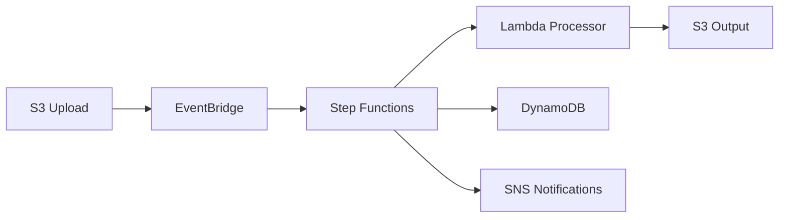

# Event-Driven Sleep Audio Pipeline

A serverless pipeline built with AWS CDK (Python) for processing audio content intended for sleep and relaxation applications. This project serves as an experiment in **TDD-driven Infrastructure as Code** developed entirely through AI agent collaboration using strict issue-driven development and meta-prompting techniques.

---

## Table of Contents

- [Project Overview](#project-overview)
- [Architecture Summary](#architecture-summary)
- [Quick Start](#quick-start)
- [Testing](#testing)
- [CI/CD](#cicd)
- [Experiment Methodology](#experiment-methodology)
- [Meta-Prompting and Agent Guidelines](#meta-prompting-and-agent-guidelines)
- [Project Structure](#project-structure)
- [Supported Audio Formats](#supported-audio-formats)
- [Documentation](#documentation)
- [License](#license)
- [Contributing](#contributing)

---

## Project Overview

This project implements a fully serverless audio processing pipeline on AWS where users upload raw audio files or text scripts to an S3 bucket, and the system automatically processes them through a multi-step workflow: validating inputs, converting text to speech via Amazon Polly, storing processed audio, tracking metadata in DynamoDB, and sending notifications on completion or failure.

### What Makes This Project Unique

This is not just another CDK application. It is a **TDD Infrastructure as Code experiment** where:

- Every piece of infrastructure was developed using strict **test-driven development** (write failing test first, then implement)
- All development is **issue-driven** with single-concern issues resolved through AI agent collaboration
- The entire codebase was built through **AI agents** following documented guidelines and meta-prompts
- **298 tests** cover all infrastructure resources, Lambda behavior, error scenarios, and multi-environment configurations
- The project demonstrates how meta-prompting patterns can drive reliable, reproducible IaC development

### Key Features

- **S3 upload trigger** via EventBridge (no polling)
- **Step Functions orchestration** with retry policies and error handling
- **Lambda processing** with dual-mode behavior (audio passthrough and text-to-speech)
- **Amazon Polly TTS** for converting text scripts into natural-sounding audio
- **DynamoDB metadata tracking** with full lifecycle status updates
- **KMS-encrypted SNS notifications** for success and failure events
- **Multi-environment support** (dev, stage, prod) via CDK context
- **CDK Pipeline** for self-mutating CI/CD deployments
- **CloudWatch alarms** for state machine failures and Lambda errors
- **X-Ray tracing** for end-to-end distributed tracing

---

## Architecture Summary

The pipeline follows an event-driven, loosely coupled design where each component communicates through events rather than direct invocation:



**Pipeline flow:**

1. **Upload** -- Audio or text files land in the S3 input bucket
2. **Event Detection** -- EventBridge captures the `ObjectCreated` event and triggers Step Functions
3. **Processing** -- Lambda validates, processes (audio passthrough or Polly TTS), and uploads output
4. **Metadata** -- DynamoDB tracks the lifecycle of each file (PROCESSING, COMPLETED, FAILED)
5. **Notification** -- KMS-encrypted SNS topics alert subscribers of success or failure

For the full system design, detailed Mermaid diagrams, service rationale, and implementation status, see **[ARCHITECTURE.md](./ARCHITECTURE.md)**.

---

## Quick Start

### Prerequisites

- Python 3.11 (managed via pyenv)
- Node.js 22 (for AWS CDK CLI)
- AWS CDK CLI (`npm install -g aws-cdk@2`)
- AWS account with configured credentials
- boto3 (for Lambda handler development/testing)

### Setup

```bash
# Set Python version
pyenv local 3.11.15

# Install dependencies
pip install -r requirements.txt -r requirements-dev.txt
pip install boto3 botocore

# Run the test suite
NODE_OPTIONS='' pytest tests/ -q

# Synthesize CloudFormation (dev environment)
NODE_OPTIONS='' npx cdk synth -c environment=dev --quiet
```

> **Note:** The `NODE_OPTIONS=''` prefix is required to avoid a proxy-bootstrap.js error in certain environments.

### Deploy

```bash
# Development
cdk deploy -c environment=dev

# Staging
cdk deploy -c environment=stage

# Production
cdk deploy -c environment=prod
```

Each environment has different configurations for log retention, removal policies, and alarm actions. See [ARCHITECTURE.md](./ARCHITECTURE.md#multi-environment-support) for details.

### CDK Pipeline (Self-Mutating)

For automated deployments via CodePipeline:

```bash
cdk deploy PipelineStack -c deploy_pipeline=true
```

The pipeline connects to GitHub via CodeStar Connections and automatically deploys on push.

---

## Testing

This project follows a **TDD-first** approach. All infrastructure and Lambda logic is covered by tests written before implementation. The test suite contains **298 tests** across 15 test files.

### Running Tests

```bash
# Run all tests
NODE_OPTIONS='' pytest tests/ -q

# Run with coverage
NODE_OPTIONS='' pytest tests/ --cov=cdk_base --cov=lambda -q

# Run a specific test file
NODE_OPTIONS='' pytest tests/unit/test_e2e_flow.py -q

# Run with verbose output
NODE_OPTIONS='' pytest tests/ -v
```

### Test Categories

| Category | Test Files | What is Tested |
|----------|-----------|----------------|
| Core infrastructure | `test_cdk_base_stack.py` | S3, EventBridge, basic stack structure |
| Orchestration | `test_step_functions.py`, `test_pipeline_e2e.py` | State machine definition, transitions, pipeline flow |
| Data layer | `test_dynamodb_metadata.py` | DynamoDB schema, billing, encryption |
| Notifications | `test_sns_notifications.py` | SNS topics, KMS encryption, integration |
| Lambda | `test_lambda_handler.py`, `test_lambda_integration.py` | Handler logic, permissions, configuration |
| Audio processing | `test_audio_processing.py`, `test_audio_processing_infra.py` | Processing logic, S3/Polly grants |
| Multi-environment | `test_multi_environment.py` | Dev/stage/prod configuration differences |
| Pipeline | `test_pipeline_construct.py`, `test_pipeline_validation.py` | CDK Pipeline construct, validation |
| End-to-end | `test_e2e_flow.py` | Full Lambda flow with mocked AWS services |
| Observability | `test_error_handling_observability.py` | Retries, error catches, alarms, X-Ray |

### Testing Tools

- `aws_cdk.assertions` for validating synthesized CloudFormation templates
- `unittest.mock` for Lambda handler tests with mocked AWS services
- Shared fixtures in `tests/conftest.py` for template generation
- `pytest-cov` for coverage reporting

### TDD Methodology

The development cycle for every feature follows this strict order:

1. **Write failing tests** defining expected resource properties or behavior
2. **Implement minimal code** to make the tests pass
3. **Refactor** while keeping tests green
4. **Verify synthesis** across all environments
5. **Repeat** for the next component

---

## CI/CD

### GitHub Actions

A CI workflow (`.github/workflows/ci.yml`) runs on every push and pull request to `main`:

1. Sets up Python 3.11 and Node.js 22
2. Installs all Python dependencies
3. Runs the full test suite (`pytest tests/`)
4. Validates CDK synthesis for all three environments (dev, stage, prod)
5. Runs `cdk diff` for visibility into infrastructure changes

This ensures that all environment configurations produce valid CloudFormation before merging.

### CDK Pipeline

The project includes a self-mutating CDK Pipeline (`PipelineStack`) for production deployments:

- **Source**: GitHub repository via CodeStar Connections
- **Synth**: Installs dependencies and runs `cdk synth`
- **Deploy**: Deploys the application stack through an `ApplicationStage`
- **Self-mutating**: Pipeline updates itself when changes are pushed

```bash
# Activate the pipeline
cdk deploy PipelineStack -c deploy_pipeline=true
```

---

## Experiment Methodology

This project is an experiment in **pure issue-driven development with AI agents**. The methodology is designed to demonstrate that complex infrastructure can be built reliably through structured meta-prompting and strict development rules.

### Core Principles

1. **Issue-driven development**: Every change originates from a single-concern issue. No speculative work, no scope creep. Each issue maps to exactly one pull request with a conventional commit message.

2. **Strict TDD**: No infrastructure resource or Lambda behavior is implemented without a failing test first. This is enforced through agent guidelines, not just convention.

3. **AI agent execution**: All implementation work is performed by AI agents following documented guidelines. The agents read `ARCHITECTURE.md` as their source of truth and follow the TDD cycle without deviation.

4. **Incremental delivery**: The pipeline was built one component at a time, layer by layer: S3 buckets first, then EventBridge, then Step Functions, then Lambda, then DynamoDB, then SNS, then observability.

5. **Architecture as contract**: `ARCHITECTURE.md` serves as the binding specification. Agents cannot add resources not described there without first updating the architecture document.

### Development Flow

```
Issue Created -> Agent Reads ARCHITECTURE.md -> Write Failing Tests -> Implement -> Verify -> PR
```

### Results

- 298 tests covering all infrastructure and Lambda behavior
- Zero manual console changes throughout the entire project
- All environments (dev, stage, prod) synthesize valid CloudFormation
- Clean separation between architecture specification and implementation

---

## Meta-Prompting and Agent Guidelines

This project documents reusable patterns for driving IaC development with AI agents. The meta-prompting approach enables consistent, reproducible infrastructure development by providing structured templates that agents follow.

Key resources:

- **[META-PROMPTS.md](./META-PROMPTS.md)** -- Reusable prompt templates and patterns extracted from this project, adaptable to other CDK/IaC projects
- **[AGENT_GUIDELINES.md](./AGENT_GUIDELINES.md)** -- Specific rules and conventions for agents working on this project

These documents capture the methodology that produced 298 passing tests and a complete serverless pipeline through pure agent-driven development.

---

## Project Structure

```
cdk-sleep-py-kiro/
  app.py                          # CDK app entry point
  cdk.json                        # CDK configuration and context
  requirements.txt                # Runtime dependencies (aws-cdk-lib, constructs)
  requirements-dev.txt            # Dev dependencies (pytest, pytest-cov)
  cdk_base/
    __init__.py
    cdk_base_stack.py             # Main stack (S3, EventBridge, Step Functions, Lambda, DynamoDB, SNS, CloudWatch)
    pipeline_stack.py             # CDK Pipeline stack (self-mutating CI/CD)
  lambda/
    sleep_audio_processor/
      handler.py                  # Lambda handler (validation, audio processing, Polly TTS)
  tests/
    __init__.py
    conftest.py                   # Shared pytest fixtures (template generation per environment)
    unit/
      __init__.py
      test_cdk_base_stack.py      # Core stack resource tests
      test_step_functions.py      # State machine definition tests
      test_dynamodb_metadata.py   # DynamoDB table configuration tests
      test_sns_notifications.py   # SNS topic and encryption tests
      test_lambda_integration.py  # Lambda permissions and configuration tests
      test_lambda_handler.py      # Lambda handler unit tests (mocked AWS)
      test_audio_processing.py    # Audio processing logic tests
      test_audio_processing_infra.py  # Audio processing infrastructure tests
      test_multi_environment.py   # Multi-environment configuration tests
      test_pipeline_construct.py  # CDK Pipeline construct tests
      test_pipeline_validation.py # Pipeline validation tests
      test_pipeline_e2e.py        # End-to-end pipeline state machine tests
      test_e2e_flow.py            # End-to-end Lambda flow tests (mocked services)
      test_error_handling_observability.py  # Error handling, retries, alarms, X-Ray tests
  .github/
    workflows/
      ci.yml                      # GitHub Actions CI workflow
  ARCHITECTURE.md                 # Full system design and architecture (source of truth)
  AGENT_GUIDELINES.md             # Guidelines for AI agents and contributors
  META-PROMPTS.md                 # Reusable meta-prompting patterns for IaC development
  SUMMARY.md                      # Project summary and key decisions
  LICENSE                         # Apache License 2.0
```

---

## Supported Audio Formats

| Extension | Format | Processing Mode |
|-----------|--------|-----------------|
| `.mp3` | MPEG Audio Layer III | Audio passthrough (download, upload to output) |
| `.wav` | Waveform Audio File | Audio passthrough |
| `.ogg` | Ogg Vorbis | Audio passthrough |
| `.flac` | Free Lossless Audio Codec | Audio passthrough |
| `.txt` | Plain text | Text-to-speech via Amazon Polly (VoiceId: Joanna) |

Files with unsupported extensions are rejected with a validation error. All output is stored in MP3 format with key `processed/{basename}_{uuid}.mp3`.

---

## Documentation

| Document | Description |
|----------|-------------|
| [ARCHITECTURE.md](./ARCHITECTURE.md) | Full system design, Mermaid diagrams, service rationale, and implementation status |
| [AGENT_GUIDELINES.md](./AGENT_GUIDELINES.md) | Development guidelines, conventions, testing instructions, and troubleshooting |
| [META-PROMPTS.md](./META-PROMPTS.md) | Reusable meta-prompting patterns and templates for IaC development with AI agents |
| [SUMMARY.md](./SUMMARY.md) | Project summary, key decisions, and experiment notes |
| [LICENSE](./LICENSE) | Apache License 2.0 |

---

## License

This project is licensed under the [Apache License 2.0](./LICENSE).

---

## Contributing

This project uses AI agents as the primary contributors, following strict guidelines:

1. **Read [AGENT_GUIDELINES.md](./AGENT_GUIDELINES.md)** for development rules and conventions
2. **Follow TDD**: Write failing tests before implementing any infrastructure or Lambda logic
3. **Use conventional commits**: `feat:`, `fix:`, `chore:`, `docs:`, `refactor:`
4. **Single-concern PRs**: Each pull request addresses exactly one issue or feature
5. **Respect the architecture**: All changes must align with [ARCHITECTURE.md](./ARCHITECTURE.md) or update it first
6. **Multi-environment validation**: Verify `cdk synth` succeeds for dev, stage, and prod before submitting

For reusable patterns on how to instruct AI agents for IaC work, see [META-PROMPTS.md](./META-PROMPTS.md).
